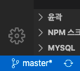
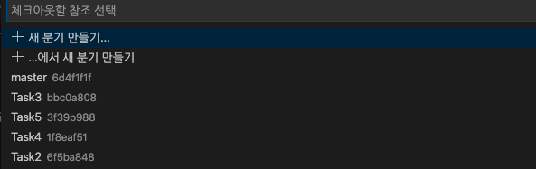

## 11번가 만들어보기

여기까지 하느라고 정말정말 고생 많았습니다.

좀 제대로 많이 알려주고 싶었는데, 하나를 알려주기 위해서는 열 개를 알아야 되는게 가르침이잖아요?

제가 열까지는 알지도 못하고 알 능력도 안되서 하나도 제대로 못가르쳐 준 것 같은데

이 과제를 진행한다는 게 참 신기합니다.

> 물론 안하고 7번 업데이트 되서 오 이거 뭐지 하고 들어와본 사람은 말구요 ^^ (돌아가서 마저 하고 오세요~)

자, 그럼 과제를 시작해볼게요

<br></br>

## 일단 과제 설명에 앞서서 Git에 대해

뭐 엄청난 걸 할 건 아니고 11번가 개발한 거 남겨놓으면 좋잖아요?

그래서 어떻게 할꺼냐?

각자 본인의 이름으로 브랜치를 만듦니다. 자 어떻게 만드냐?

일단 모두 master branch로 이동해야 합니다.

vscode의 왼쪽 하단을 보세요



여기서 `master`를 누르세요. 다른 이름일 수도 있어요. 브랜치를 만들었다면?



그럼 여기서 `origin/master` 라고 친 다음 `origin/master` 브랜치를 클릭하세요

자 이런 다음에 다시 왼쪽 하단 `master`를 누르고 ~

그리고 거기에 본인 이름을 적으세요 ex) dohyeon

그런 다음 `새 분기에서 만들기...` 이걸 눌러요!

자 다 왔습니다. 그럼 아까 왼쪽 하단에 만들어져 있던 거에서 구름이 보일꺼에요 그 구름을 누르세요

그럼 이제 본인들의 브랜치가 생긴거에요~ 거기서는 commit, push 다 할 수 있어요!

근데, 만약 제가 처음에 만들어준 파일이 날라갈 수도 있잖아요?

그래서 master 브랜치에 pull request라는 건 하면 안됩니다!!!

제발 하지마세요!!!! 다른 건 다 되요 맘대로 하세여 거기서부턴

> 혹시 정말정말 너무너무 궁금하면 Git Study 레포가서 막 만들어보고 pull request도 해보고 하세여  
> 근데 만약 정말정말정말 실수로 그래버렸다!? 그럼... 절 부르세요...

<br></br>

## 자~ 그럼 11번가 개발을 들어가봅시다.

일단 Task7을 들어가 봅시다.

그리고 거기 안에 본인들이 원하는 이름의 폴더를 만들어보세요!

거기다가 개발하는 거에요~ 왜냐면 제가 README파일이랑 png파일들이 설정때매 꼬일 수가 있거든요

자 방금 폴더 만들었죠? 그럼 거기다가 Task7폴더 안에 `package.json`파일 보이시죠?

그걸 방금 만든 폴더에 넣으세요~ 그리고 terminal로 방금 만든 폴더까지 들어가서

`npm install` 해주세요. 기본적으로 필요한 모듈들은 다 알아서 설치될꺼에요

그리고 만든 폴더 안에 `index.ts` 라고 작성해주세요. 그리고 간단하게 코드를 작성해봅시다.

```TypeScript
console.log('Ready For Develope');
```

그리고 terminal을 사용해서 만든 폴더까지 들어가서 `npm start index.ts`를 입력해주세요

잘 되나요? 그럼 개발 준비가 진짜 다 끝난겁니다.

안 되나요? 먼저 개발을 시작한 사람들한테 물어보세요, 구글링해보세요, 정 안되면 도와드릴게요

<br></br>

## 개발 팁

제가 만든 11번가 예시 코드 directory를 다들 가봤을 껍니다.

보면 interface라는 폴더가 있고, src라는 폴더가 있죠? 그리고 option.ts, index.ts가 있구요

여기서 option.ts폴더를 확인하면 11번가를 사용하기 위한 API 키가 있어요 그걸 활용해서 적용해야 합니다~

[11번가 개발가이드](http://openapi.11st.co.kr/openapi/OpenApiGuide.tmall) 를 보고 개발하세요!

URL은 기본정보조회라는 걸 사용해야되요. 그리고 여기서부턴 스스로 공부하면서 해보세요.

<br>

쪼오금 더 알려주자면

request 할 때, url은 기본적으로 http://openapi.11st.co.kr/openapi/OpenApiService.tmall? 여기까지만 사용하고

뒤에 ? 가 달렸고 `key=[key]` 막 이렇게 되어있죠? 뒤에 있는 애들은 query string이라는 애들입니다. 검색해서 알아보세요

Request parameter에 뭘 넣어줘야 하는지 이게 필수인지 아닌지가 나와있고 반환형이 xml 형식이에요

이 xml 형식을 직접 어떻게 처리하긴 힘들어서 미리 `xml2js`이라는 모듈을 설치해놨어요

그것도 검색해서 어떻게 사용하는지 찾아보세요

아 그것도 있구나, 예제에 encoding을 보면 'EUC-KR'이라고 나와있죠??

'EUC-KR'로 인코딩이 되어있다는 거에요 암호화 되어있다는 거죠 궁금하면 검색 더 해서 공부해보세요~

이걸 푸는 건 `iconv-lite`라고 있어요 이것도 미리 다 같이 설치되었으니 import 해서 쓰시면 됩니당

<br>

### 마지막 팁

최고의 디버깅은 print입니다. `console.log` 자주 해보세요!! 꼭!!

그리고 최고의 공부법은 답을 안보고 푸는 거에요, 스스로 공식을 이해하고 풀어내야 본인의 실력이 되듯이

제 예시 코드를 보고 짜는 건 의미 없어요 어떻게 짜던 잘못된거 아니에요 일단 되기만 하면 됩니다.

그 이후에 구조에 대해서는 나중에 알려줄게요 그럼 20000

### 화이팅!!!
